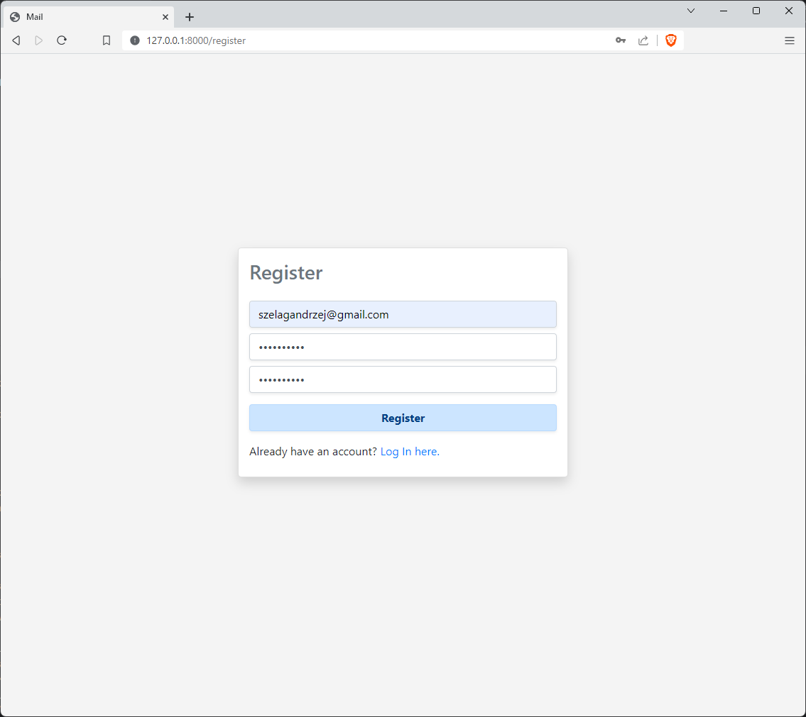
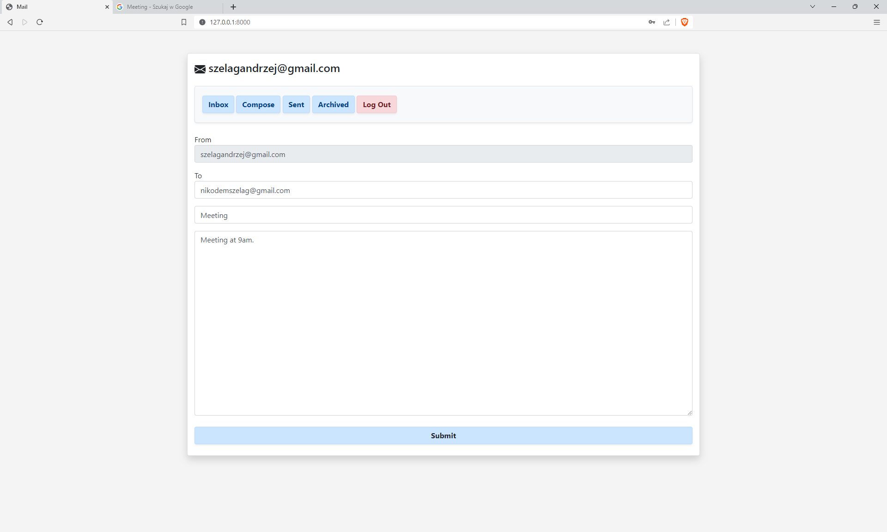
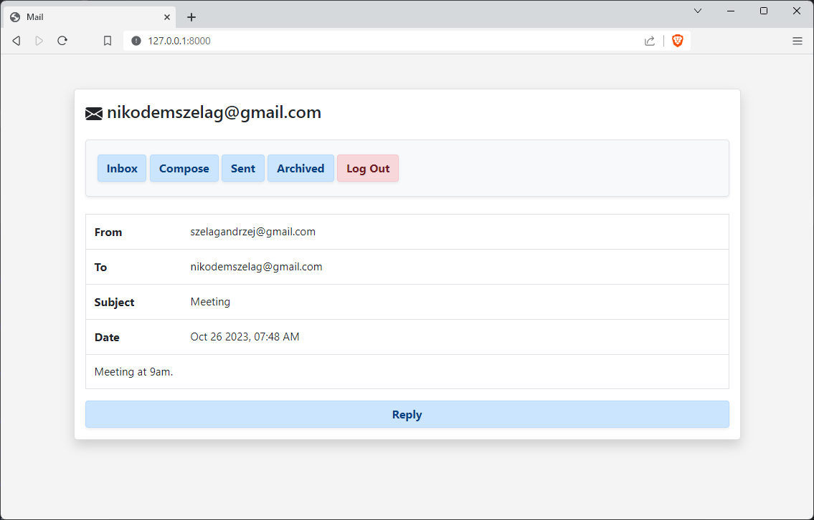
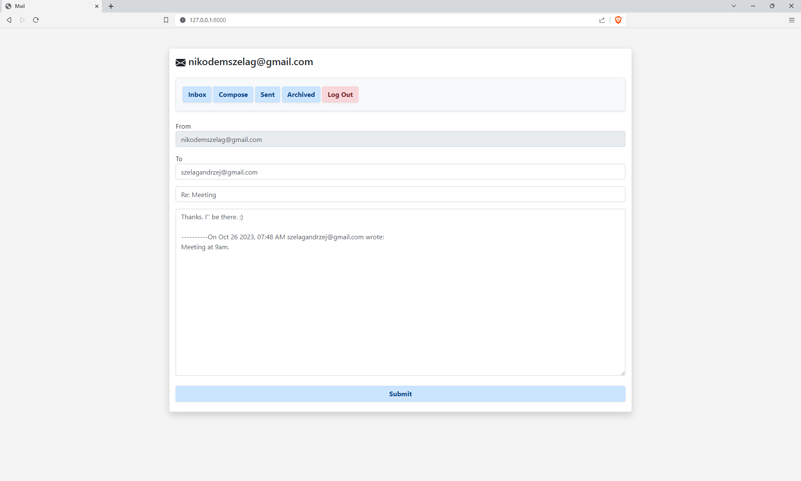
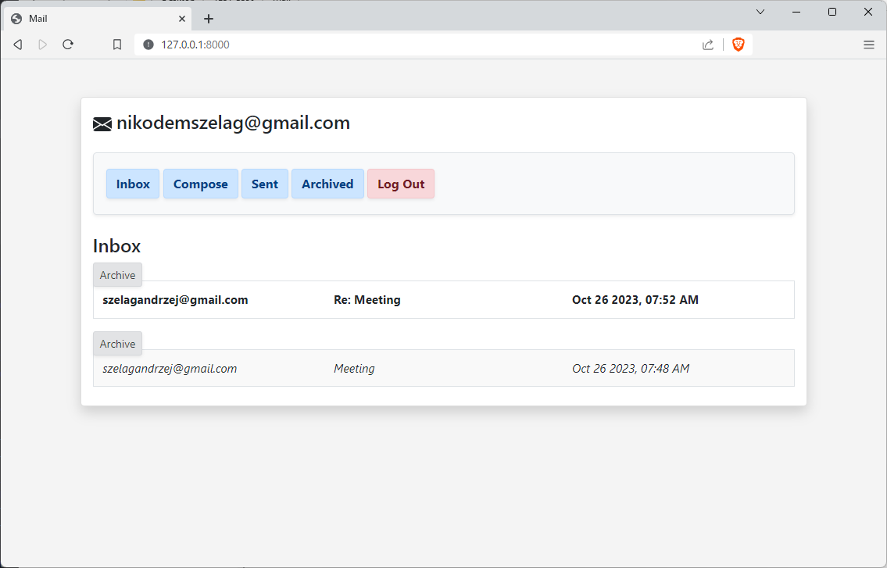
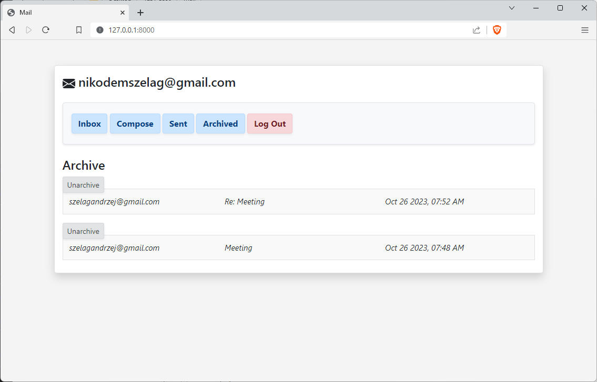

# Mail

#### 📘Project 3 from Edx | Harvard CS50's Web Programming with Python and JavaScript Course

✒️ Design a front-end for an email client that makes API calls to send and receive emails.

## Specification 
🚀 https://cs50.harvard.edu/web/2020/projects/3/mail/

## Video

🚀 [Mail project on YouTube](https://youtu.be/FQLo7GbbeNk)

### Requirements

* Python 3.11.1
* Django 4.1.4

__TIP__: If you have a _requirements.txt_ file type this command: __python -m pip install -r requirements.txt__

* ### How to run? 
1. Go to the directory which contains "__manage.py__" file
2. Then type this command: __python manage.py runserver__
3. In your Web browser use a URL: __http://127.0.0.1:8000/__ or __http://127.0.0.1:8000/login__

